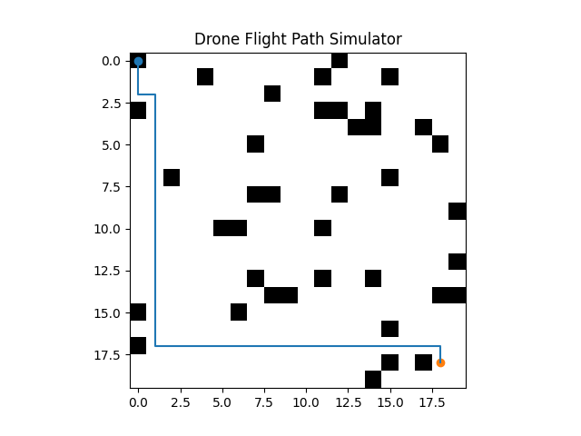

# Drone Flight Path Simulator

A Python-based drone navigation simulator that computes and visualizes optimal flight paths in a grid environment with obstacles.  
The simulator implements classical path planning algorithms such as **A\*** and **Dijkstra** to determine efficient routes between two points.

This project demonstrates how autonomous drones can safely navigate complex environments before real-world deployment.

---

# Project Overview

Drones are widely used in industries such as logistics, surveillance, agriculture, and disaster response.  
However, testing navigation algorithms on real drones is expensive and potentially dangerous.

This simulator provides a safe virtual environment to experiment with and evaluate drone path planning algorithms.

The system:

- Generates a grid-based environment
- Places obstacles in the environment
- Computes the optimal route between start and destination points
- Simulates drone movement along the calculated path
- Visualizes the route and environment

---

# Features

- Grid-based environment simulation
- Obstacle generation
- Path planning using **A\*** algorithm
- Path planning using **Dijkstra algorithm**
- Drone movement simulation
- Visualization of flight path
- Performance metrics (distance, time, battery usage)

---

# Algorithms Implemented

## A* Algorithm

A heuristic-based pathfinding algorithm that efficiently finds the shortest path by combining:

- Actual cost from start
- Estimated cost to goal

It is widely used in robotics, games, and autonomous navigation.

## Dijkstra Algorithm

A classical shortest path algorithm that guarantees the optimal path in weighted graphs but does not use heuristics.

This project compares its results with A*.

---

# Project Structure
drone-flight-path-simulator
│
├── main.py # Entry point of the simulator
├── grid.py # Grid environment and obstacle generation
├── astar.py # A* pathfinding algorithm
├── dijkstra.py # Dijkstra pathfinding algorithm
├── simulator.py # Drone movement simulation
├── visualization.py # Path and grid visualization
├── utils.py # Helper functions and metrics
│
├── requirements.txt # Required Python libraries
├── README.md # Project documentation
│
└── test_cases
└── scenarios.md # Simulation testing scenarios

---

# Installation

Clone the repository:
git clone https://github.com/your-username/drone-flight-path-simulator.git

cd drone-flight-path-simulator

Install dependencies:
pip install -r requirements.txt

---

# Running the Simulator

Run the main program:
python main.py

The simulator will:

1. Generate a grid environment
2. Add random obstacles
3. Compute optimal paths using A* and Dijkstra
4. Simulate drone movement
5. Visualize the flight path

---

# Example Output

Console output:

Running A*
Running Dijkstra

A* path length: 28
Dijkstra path length: 28

Distance: 28
Time: 14
Battery: 5.6

Drone moving to: (0,0)
Drone moving to: (1,0)
Drone moving to: (2,0)
...

A visualization window will display:

- Obstacles
- Start point
- Destination
- Calculated path

---

# Applications

This project has applications in multiple domains:

- Drone delivery systems
- Autonomous robotics navigation
- Disaster response planning
- Smart city aerial mapping
- Military surveillance route planning

---

# Future Improvements

Possible extensions include:

- 3D drone flight simulation
- Wind and environmental effects
- Multi-drone coordination
- Machine learning based route optimization
- Real drone hardware integration
- Interactive GUI dashboard

---

# Technologies Used

- Python
- NumPy
- Matplotlib

Algorithms:

- A*
- Dijkstra

---

# Team Members

- Lakshmi A  
- Prithu Ashish  
- Dhana Sridhar Gopalakrishnan  
- Pradeep C  
- Ansh Gupta  

Mentor: **Prof. Reya Sharma**  
Institution: **VIT University – Vellore**

---

# References

- Hart, Nilsson, Raphael — *A Formal Basis for the Heuristic Determination of Minimum Cost Paths*  
- Python Pathfinding Tutorials  
- Drone Navigation Research Papers (IEEE)

## Simulation Output

